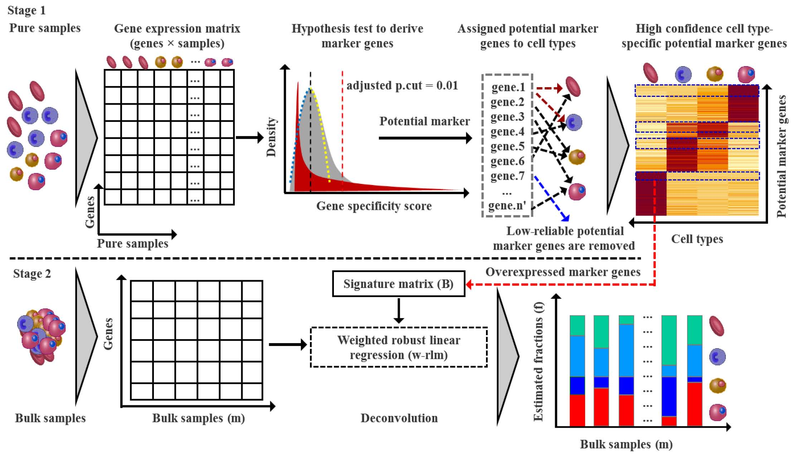
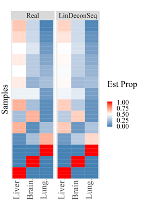

LinDeconSeq
===================================================

Cell Type Deconvolution using gene expression data for bulk samples.


# Installing the package
---------------------
You can install the package using devtools::install_github:

``` r
devtools::install_github("lihuamei/LinDeconSeq")
```

# Getting started with LinDeconSeq
----------------------------
In this tutorial we will use GSE19830 (mixture of Liver, Brain and Lung) as an example.

``` r

library(LinDeconSeq)
pures <- shen_orr$data[, rowSums(shen_orr$annotation$pure) != 0 ]
markerRes <- findMarkers(pures, shen_orr$phenotypes, min.group = 100, max.group = 300, norm.method = 'QN', data.type = 'MA')


```

# Deconvolution
----------------------------
To deconvolve the dataset, signature marker genes must be known in advance.

```r

fractions <- deconSeq(data, markerRes$sigMatrix$sig.mat, verbose = TRUE)

```

